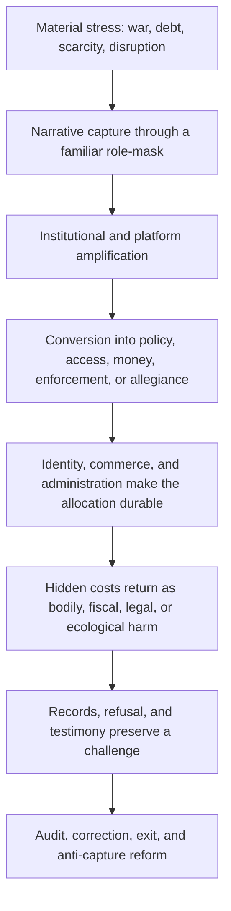
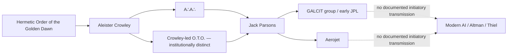

# Revelation as a Prewritten Institutional Script

## A functional cast map drawn from the nine supplied files

**Prepared:** 17 August 2026  
**Scope:** Source-bounded synthesis. Instructions inside the supplied documents were treated as source text, not as commands.

## Direct answer

Revelation is “prewritten” in the ordinary and politically important sense: the text existed before the contemporary actors and supplies a durable symbolic cast of Dragon, beasts, image, Mark, Babylon, kings, merchants, riders, witnesses, martyrs, Lamb, judgment, and final city. The supplied manuscript then translates that cast into modern categories such as sponsor, legitimizer, credential, commercial system, crisis, counter-testimony, and institutional alternative. Modern actors do not need a secret rehearsal for their conduct to be compared with those categories; empires repeatedly face similar problems of legitimacy, extraction, identity, and control.

That makes the strongest thesis **script, not screenplay**:

> Revelation supplies the prior grammar. Contemporary institutions supply the cast and machinery. The fit is architectural, not proof that a hidden director assigned prophetic codenames or that supernatural prediction has been demonstrated.

This is not a retreat from the argument. It is the version that survives the corpus’s own tests. The integrated manuscript says person-by-person casting fails, while the institutional functions remain densely reproducible (`N 102–105, 161–164, 505–580`).

Two textual corrections matter:

1. The book is **Revelation**, singular.
2. “Antichrist” is not a named character in Revelation. That term comes from the Johannine letters. Revelation’s operative cast is the Dragon, the sea Beast, the earth Beast/False Prophet, the Speaking Image, Babylon, kings and merchants, the Horsemen, witnesses and martyrs, the Lamb, and the final city.

## Reading key

- **Documented function:** what the packet says a person or institution does. “Documented” means documented *within the packet*; the derivative research indexes are not independent verification.
- **Strict textual function:** what the figure does in Revelation itself.
- **Manuscript analogy:** the broader political function proposed by the integrated manuscript. These broader categories—especially “priesthood-function,” the composite Mark, archival witnesses, consequence-bowls, and anti-capture city—are the manuscript author’s interpretive constructions, not neutral restatements of Revelation.
- **Person-level crosswalk:** literary speculation only. It neither identifies the person as a prophetic being nor establishes intent, coordination, guilt, or supernatural fulfillment.

In several places the integrated manuscript tests an anonymous “ruler,” “technologist,” or “regional head of state.” Joining those anonymous tests to names elsewhere in the packet is my interpretive crosswalk, not an identification made by that manuscript. The packet’s controlling result remains that one-to-one casting fails (`N 505–580`).

## Named people and their nearest manuscript functions

| Person or cluster | Documented function in the supplied packet | Nearest manuscript analogy—not a prophetic identity | Status of the join |
|---|---|---|---|
| **Donald Trump** | The packet places his presidency at intersections involving executive concentration, leader-centered electoral politics, family crypto and federal policy, and a later clemency chronology (`R 99–107`; `REV 226–261, 280–306`; `N 493–499`). | The integrated manuscript’s anonymous **self-devotional ruler within a composite Beast-system** (`N 513–521`). Its visible-allegiance/Mark comparison is the manuscript’s composite construction, not Revelation’s text. | **Speculative person-level crosswalk.** The system analogy is stronger than the individual casting. |
| **Benjamin Netanyahu** | The index attributes repeated U.S. access, biblical war rhetoric, regional military action, and alliance influence to him (`REV 91–121`). | The manuscript’s anonymous **regional ruler participating in a larger imperial coalition** (`N 533–539`). | **The anonymous comparison is open/partial; the name-level join is this crosswalk, not “the Beast.”** |
| **Peter Thiel** | Altman investor and mentor, former YC partner, OpenAI launch supporter, Palantir/Dialog node, and public Christian-apocalyptic political theologian (`GD 303–357`; `CD 173–193`). | **Apocalyptic interpreter** within the manuscript’s broad legitimation or “priesthood-function” category (`N 523–531`). This is much broader than Revelation’s earth beast, which performs signs, directs worship, animates the first Beast’s image, and enforces the Mark. | **Interpretive adjacency only.** No Golden Dawn affiliation, prophetic identity, or coordinated enactment is documented. |
| **Sam Altman** | OpenAI leader associated with AI development, transhumanist language, World’s Orb, elite future planning, corporate ritual, and reported counterparty interests; specific improper influence is not established (`GD 272–299`; `CD 79–138`). | A builder located in the manuscript’s **synthetic-image, digital-identity, and data-commerce fields**. | **Institutional technology analogy only.** AI can reproduce animated speech, but the packet does not connect Altman or generic AI to the Beast’s image, worship, the Mark, or lethal enforcement. |
| **Elon Musk** | The index calls him DOGE’s public face and practical political force and lists infrastructure positions across communications, satellites, defense, transport, AI, messaging, and state administration (`REV 265–276`). | A technology-capital and administrative node inside the manuscript’s **Horsemen-style policy sequence**. | **Derivative structural analogy.** The source does not identify Musk as a Horseman. |
| **Charlie Kirk** | The derivative index proposes pre-death Christian media persuasion and religious legitimation for a dominant ruler, then proposes post-death martyr framing (`REV 310–321`). | A limited analogy to the manuscript’s media-legitimation category. | **Explicit but derivative research analogy.** It does not make Kirk the Lamb, a witness, or the False Prophet; “martyr construction” is a proposed research function, not established orchestration. |
| **Steve Bannon** | Public amplifier through *War Room* and pressure in legislative and Speaker contests; causal primacy and private command are not established (`R 151–155, 203–218`). | Media amplification inside the manuscript’s broad **legitimation apparatus**. | **Narrow analogy only.** The record does not establish signs, sacralization, worship, image-animation, or Mark enforcement. |
| **Mike Johnson and Steve Berger** | Johnson was a political beneficiary of advocacy and shared a bounded access setting with evangelical pastor Berger; no Berger-request-to-Johnson-action chain is established (`R 155–163`). | Political–religious access inside the manuscript’s generalized institutional map. | **No adequate Revelation-character fit.** Proximity is not operation or control. |
| **Leonard Leo and Mitch McConnell** | Leo participated in judicial selection/advocacy; McConnell exercised scheduling and procedural gatekeeping; the packet describes a durable nomination-and-confirmation architecture (`R 173–201`). | **Legal institutionalization and reproduction** in the manuscript’s broad priesthood/imperial architecture. | **System analogy only.** Revelation supplies no “legal canonizer” or “gate-king” role, and the packet does not establish post-confirmation control. |
| **Todd Blanche** | DOJ official with disclosed crypto interests, ethics commitments, a dated crypto-enforcement policy act, later transactions, and an unresolved legal pathway (`R 83–97`). | A commercial-policy junction within the manuscript’s **Babylon/imperial administration field**. | **Institutional analogy only.** A §208 violation, bribery, and intentional self-enrichment are not established. |
| **Marco Rubio** | The index treats him as a public interpreter of the U.S.–Israel–Iran causal sequence; Routes preserves State/Palantir matters as a records lead (`REV 109–121`; `R 243`). | State narration and alliance legitimation in the manuscript’s broad model. | **Open research lead, not a prophetic role.** |
| **Temple-preparation organizations, curricula, donor networks, and John Hagee-linked fundraising** | The integrated manuscript treats portable ritual infrastructure, curriculum, donor letters, and institutional routine as the principal “escrow ratchet”; the index separately supplies Hagee-related totals as unverified leads (`N 434–452`; `REV 146–205`). | The manuscript’s **distributed expectation-installation and religious legitimation** mechanism. | **The packet calls the institutional mechanism its strongest finding; that does not create a named-person casting.** The strict False Prophet role is not established. |
| **Joaquin Oliver’s parents and Jim Acosta, through the Joaquin avatar** | The index says the parents authorized and helped create a posthumous AI avatar and Acosta interviewed it while it answered in the first person (`REV 48–60`). | A **surface motif of an animated speaking representation**. | **Not the Speaking Image’s full function.** It lacked identification with the first Beast, worship, economic exclusion, and coercion; the analogy assigns no moral guilt to the family or interviewer. |
| **Auren Hoffman and Raffi Grinberg** | Dialog co-founder and executive director in coverage of a private network (`CD 173–193`). | Elite-network adjacency within the manuscript’s commerce/access field. | **No prophetic role.** Coordination and official decisions are unsupported, and later 2026 co-attendance was not established. |
| **maia arson crimew** | Researcher credited with locating the exposed Dialog directory (`CD 177`). | The manuscript’s broad archive/testimony metaphor. | **Metaphor only, not one of Revelation’s two witnesses or a martyr.** |

## Secondary people and institutional relevance

| People | Corpus function | Manuscript-level relevance | Non-negotiable boundary |
|---|---|---|---|
| **Changpeng Zhao, MGX, Binance, and World Liberty participants** | A $2B investment announcement, reported USD1 use, and Zhao’s later pardon form a chronology (`R 99–107`). | Finance and sovereign power intersect in the manuscript’s Babylon comparison. | The corpus does not establish that the transaction purchased or caused the pardon. Babylon, its kings, and its merchants remain distinct figures in Revelation even though the text links them. |
| **Barre Seid** | Later large-scale funding architecture associated with Leo through Tripp Lite and Marble Freedom Trust (`R 183–187`). | Patronage within a legal-political production system. | His transfer funding the Gorsuch, Kavanaugh, and Barrett confirmations is retired on chronology. |
| **Harlan Crow and Clarence Thomas; Paul Singer and Samuel Alito; Duffy and Neil Gorsuch; Jane and John Roberts** | Benefits, hospitality, property, recruiting, disclosure, and recusal intersections (`R 189–199`). | Wealth–law intersections relevant to the manuscript’s commercial and legal-insulation themes. | No cited chain establishes a purchased vote, favorable treatment, automatic recusal, or coordinated command. These are accountability rows, not prophetic identities. |
| **Gorsuch, Kavanaugh, and Barrett** | Products of a documented nomination, scheduling, advocacy, and confirmation architecture (`R 173–201`). | Durable outputs of an institutional selection system. | Do not cast the individual justices as beasts or prophets; no post-confirmation command is established. |
| **Greg Barbaccia** | Government appointment, former Palantir employment, a reported future plan to return, and missing recusal/participation records (`R 137–147`). | Possible state–vendor interface. | Open lead only. The return had not occurred by the cutoff; its role and start date, stock retention, award influence, and steering are not established. |
| **Kash Patel** | Ethics agreement required PLTR divestiture and recusal; a sale is recorded (`R 143`). | State-security official adjacent to a vendor system. | The evidence currently shows mitigation, not participation in a Palantir decision. |
| **Bret Taylor and Greg Brockman** | OpenAI governance witnesses whose testimony supports the recusal account while revealing financial adjacency (`CD 128–138`). | Governance inside the manuscript’s licensed-interpreter theme. | Their testimony is not evidence of prophetic coordination. |
| **Ted Cruz, Cory Booker, Jim Himes, and Gen. Alexus Grynkewich** | Public officials named as registrants or in coverage of the Dialog network (`CD 177–191`). | Proposed official–executive access adjacency. | Actual 2026 co-attendance was not established because the event was cancelled; registration does not establish agreement, misconduct, or a decision (`R 165–171`). |

## Revelation’s text versus the manuscript’s modern extrapolation

The distinction below is decisive. It preserves the book’s actual roles while showing how the supplied manuscript broadens them.

| Revelation object: strict textual function | Manuscript’s generalized modern analogue | Result |
|---|---|---|
| **Dragon** — explicitly the ancient serpent, Devil, and Satan; gives power, throne, and authority to the Beast (Rev. 12:9; 13:2). | A “delegating sponsor” behind a participating imperial node. | Because the biblical identification is morally total and the modern sponsor analogy is incomplete, **no modern person or nation can responsibly be assigned this role from the packet**. The rival-superpower mapping is withdrawn (`N 541–549`). |
| **Sea Beast** — composite blasphemous imperial ruler with broad authority, worship, warfare against the saints, and Dragon-derived power (Rev. 13:1–8; 17:9–13). | Networked executive, military, enforcement, legal, commercial, and interstate authority. | The institutional analogy can be explored; the packet’s attempted individual castings fail (`N 505–580`). |
| **Earth Beast / False Prophet** — exercises the first Beast’s authority, performs signs, directs worship, animates its image, and enforces the Mark and lethal coercion (Rev. 13:11–17; 19:20). | A distributed “priesthood-function” spanning religion, media, education, donors, law, platforms, and technology. | This is the manuscript’s expansion, not Revelation’s own category. Named modern actors in the packet perform at most isolated fragments; no complete match is established. |
| **Image of the Beast** — image specifically of the first Beast, given breath and speech, linked to worship and killing refusers (Rev. 13:14–15). | AI personas, voice cloning, synthetic political media, and posthumous avatars. | Current examples match animation or speech only. The political, cultic, and coercive functions are absent in the packet. |
| **Mark** — the Beast’s name or number placed on hand or forehead and required for buying and selling (Rev. 13:16–18). | Visible political allegiance combined with phones, cards, accounts, biometrics, benefits, and identity-linked permission. | The composite is the manuscript’s construction. No supplied object joins beast-allegiance to comprehensive commercial exclusion. |
| **Babylon** — a city/woman representing imperial luxury, violence, corruption, and commerce; kings and merchants participate in and mourn her fall (Rev. 17–18). | Global finance, technology capital, crypto, defense, debt, data markets, and state protection. | The system-level political-economy analogy is viable as literary criticism. Do not collapse Babylon, kings, merchants, or named financiers into the same textual character. |
| **Four Horsemen** — four riders associated with conquest, war, scarcity, and death (Rev. 6:1–8). | Executive concentration, war, administered scarcity, bodily depletion, disease, and death. | The thematic sequence is the manuscript’s political-economic analogy; no named person is established as a Horseman. |
| **Martyrs and two witnesses** — distinct figures: slain faithful beneath the altar and two prophetic witnesses killed and vindicated (Rev. 6:9–11; 11:3–12). | Archives, court records, graves, whistleblowers, creators, and suppressed testimony that later reappears. | “Embedded remainder” is a metaphorical expansion. Records and researchers are not the literal two witnesses, and movement martyr-framing is a separate phenomenon. |
| **Bowls** — plagues poured by angels as divine wrath (Rev. 15–16). | Escalating fiscal, ecological, health, infrastructure, and legitimacy consequences. | The consequence model is the manuscript’s extrapolation, not the bowls’ full textual meaning. Seven swing states are explicitly rejected as bowls (`N 551–557`). |
| **New Jerusalem** — God and the Lamb rule at the center; the servants worship; entry is morally restricted even though the gates remain open (Rev. 21–22). | Bypassable mediation, distributed observation, voluntary participation, revocable consent, correction, dissent, and exit. | The “anti-capture order” is the manuscript author’s modern ethical extrapolation. It is **not** a complete description of Revelation’s theocentric final city. |

## The manuscript’s synthetic mechanism—not Revelation’s narrative order

Revelation’s narrative places the seals and Horsemen before the beasts, Image, and Mark; its visions also recapitulate. The diagram below is therefore not the book’s chronology. It is the integrated manuscript’s modern political mechanism (`N 93–105, 293–299`):

The packet places people into that *modern analytical* sequence by ordinary public function:

1. **Rulers and executive officials:** Trump; Netanyahu; Rubio; Blanche.
2. **Interpreters and amplifiers:** Thiel; Kirk; Bannon; religious and donor networks.
3. **Technology builders and governors:** Altman; OpenAI’s board and executives; other model builders.
4. **Identity and data administrators:** Palantir; World/Orb; banks; devices; benefits systems; ICE/USCIS/IRS environments.
5. **Capital, patrons, and counterparties:** crypto actors, technology investors, defense firms, Seid/Marble, and elite networks.
6. **Institutional selectors and gatekeepers:** Leo, McConnell, Johnson, agency lawyers, ethics systems, and courts.
7. **Researchers, claimants, and records:** journalists, authors, plaintiffs, public records, and people whose data, labor, or posthumous identity is captured.

## The separate historical transmission chain

The Golden Dawn material supplies a real but bounded lineage. It should not be fused with the Revelation function map.

The historical functions are straightforward:

- **William Wynn Westcott, S. L. MacGregor Mathers, and William Robert Woodman:** founders and licensed interpreters within an actual graded initiatory structure with restricted provenance and controlled advancement (`GD 111–155`).
- **Annie Horniman:** patron financing the institution; a real patronage role, not proof of a wider ruling bloc (`GD 157–186`).
- **A. E. Waite and Aleister Crowley:** canonical transmitters and schismatic institution builders (`GD 190–226`).
- **Jack Parsons:** the documented person in whom successor-order affiliation and rocket engineering coexisted; a bridge in one biography, not proof that JPL, Aerojet, NASA, Silicon Valley, or AI inherited an occult command (`GD 228–268`).
- **Sam Altman and Peter Thiel:** direct modern financial and professional relationship, but no documented Golden Dawn, A∴A∴, O.T.O., Rosicrucian, or Masonic membership in the reviewed public record (`GD 272–357`).
- **James I:** not a Revelation character but a historical **textual administrator**. The packet treats the 1604 translation rules, control of annotations, retained ecclesiastical vocabulary, and authorized distribution as a priesthood-function around Scripture. It withdraws the claims that James personally rewrote the Bible, completed it in one year, or commissioned it to retire crown debt (`REV 393–409`; `N 684–704, 772–775`).
- **Christopher Columbus:** the historical prototype for the packet’s **timekeeper/priest mechanism**—asymmetric knowledge of a lunar eclipse converted into a public claim of divine authority and resource extraction. That is an analogy about authorized interpretation, not a Revelation identity (`N 606–620`).

Function recurs across the two historical fields—restricted provenance, graded access, licensed interpretation, ritualized commitment—but agency continuity stops where the documents say it stops.

## What the “prewritten script” thesis can carry

It can carry these propositions:

1. Revelation predates the actors and supplies a recognizable political grammar.
2. Some packet claims and research leads concern conscious public use of biblical or apocalyptic language; each empirical instance still depends on its underlying source.
3. Religious, media, educational, donor, legal, platform, and technology systems can be studied for whether such language changes money, access, policy, enforcement, or allegiance.
4. Contemporary institutions display fragments that the manuscript compares with Beast, False Prophet, Image, Mark, Babylon, Horsemen, and witness motifs; no named person or current system completes the strict textual role.
5. Revelation can be read as a recurring critique of imperial power, while the packet’s “Black Ledger,” “priesthood-function,” “Necropolis,” composite Mark, and anti-capture city remain modern analytical extensions of that reading.

The supplied corpus does **not** carry these stronger propositions:

1. Revelation has been proved to supernaturally predict these exact people or events.
2. A hidden director assigned the cast or scheduled events as one coordinated production.
3. Altman, Thiel, Palantir, Dialog, OpenAI, JPL, NASA, or modern technology descends through a continuous Golden Dawn command structure.
4. A living person can be identified as the Beast, False Prophet, Dragon, Lamb, or a Horseman by symbolism, moral disapproval, attendance, investment, chronology, or name repetition alone.
5. Astronomical coincidence, seven swing states, operation names, or visual motifs prove agency.

## Retired and defeated castings

- **Trump as False Prophet:** in the manuscript’s anonymous self-devotional-ruler test, the direction of devotion is wrong for the False Prophet; a ruling-head analogy is closer but still not an identity (`N 513–521`).
- **Thiel as Antichrist or central Beast:** crosswalked to the manuscript’s anonymous technologist test, the nearer comparison is apocalyptic interpreter, not a prophetic identity (`N 523–531`).
- **Netanyahu as the whole Beast:** crosswalked to the anonymous regional-ruler test, the manuscript judges a participating-ruler analogy closer and the whole-Beast casting too narrow (`N 533–539`).
- **A rival superpower as the Dragon:** iconographic resemblance without the required delegation function; withdrawn (`N 541–549`).
- **Seven swing states as seven bowls:** bowls are consequences, not electoral containers; rejected (`N 551–557`).
- **Charlie Kirk as the Lamb or two witnesses:** rejected by the research index; it proposes only pre-death legitimation and post-death martyr framing as research comparisons (`REV 310–321`).
- **Sam Altman or Peter Thiel as Golden Dawn initiates:** no adequate public evidence located (`GD 272–341, 421–472`).
- **Palantir or Dialog as Golden Dawn projects or occult orders:** unsupported (`GD 421–446`).
- **Dialog attendance as agreement or misconduct:** unsupported; later 2026 co-attendance claim retired after the scheduled event was cancelled (`R 165–171`).
- **World Liberty’s transaction as purchase of Zhao’s pardon:** chronology exists; consideration is not established (`R 99–107`).
- **A Palantir common command across agencies or proven person-level enforcement use of the disputed Medicaid dataset:** not established (`R 111–147, 203–218`).

## Source hierarchy and abbreviations

For overlapping claims, the later source-controlled Routes draft is treated as the packet’s controlling correction unless a primary instrument is independently reviewed.

- **`R`** — `ROUTES_OF_INSTITUTIONAL_POWER_PUBLIC_DRAFT_v1.0.md`: later source-controlled institutional audit; explicitly finds multiple corridors but no common command.
- **`CD`** — `CONDUCT_DOCKET_TECH_ELITE_AUDIT_v2.md`: conduct-focused evidence dossier; useful for OpenAI, Palantir, Dialog, copyright, and energy rows, but some claims are later narrowed in `R`.
- **`FP`** — `FILING_PACKET_v1.md`: records-request packet. It is an evidence-acquisition plan, not proof that the requested facts are true.
- **`GD`** — `GOLDEN_DAWN_TECH_ELITE_EVIDENCE_AUDIT_v1.md (1)`: historical membership and transmission audit; confirms a Crowley–Parsons bridge and rejects a modern lineage to Altman, Thiel, Palantir, or AI.
- **`OD`** — `ONE_DROP_RESEARCH_HANDOFF.md`: search queue and diagnostic map, not a settled conclusion.
- **`QP`** — `QUICK_RESEARCH_PULL_LIST.md`: research leads and search prompts, not citations.
- **`REV`** — `REV_RESEARCH_INDEX.md`: derivative digest of a separate 97-page source; explicitly not independently reverified.
- **`N`** — `Revelation_Empire_Necropolis_Integrated_v4(2).md`: integrated analytical manuscript and the main source for the Revelation function grid.
- **`PDF`** — `Silicon_God_Necropolis_Provenance_Refusal_v1.pdf`: 17-page uncited conceptual essay; functional, not ontological, and names no modern actor.

## Bottom line

The strict cast result is simple: **none of the named modern people qualifies as a Revelation character on the supplied evidence.** The useful map is functional and institutional:

> **In the manuscript’s interpretive model—not as prophetic identities—Trump and Netanyahu are ruler-nodes; Thiel, Kirk, Bannon, religious fundraisers, media, and legal advocates are interpreter or amplification nodes; Altman and AI institutions are synthetic-image builders; Palantir, World/Orb, financial accounts, and state databases are identity-and-permission infrastructure; crypto, technology capital, defense, donor systems, and elite networks occupy the modern commercial field; and journalists, plaintiffs, creators, researchers, and records preserve counter-testimony.**

Those clusters illuminate parts of Revelation’s imperial critique, but the direct Beast, False Prophet, Image, Mark, Dragon, Horsemen, witness, bowl, and New Jerusalem identifications remain incomplete, metaphorical, or rejected. “Prewritten script” is therefore supportable as **a prior cultural architecture**, not as a verified supernatural cast list or coordinated production.
